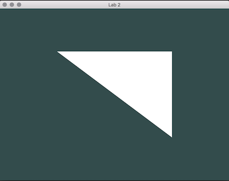
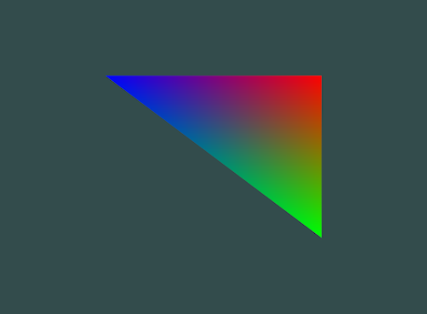

# Lab 2 - Hardware Rasterization

*You may work in pairs on this assignment. To receive credit, demonstrate your
completed program during lab or push your code up to Bitbucket and submit the
hash to D2L.*

In this assignment, you’ll be using OpenGL and GLSL to render a single triangle
just like in lab 1.  You can use your code from lab 1 for reading in user input.
Instead of writing out an image file, you’ll be rendering straight to the screen
using OpenGL calls and GLSL shaders.

**Note** This lab is one of our last big hurdles to really getting up and
running.  It has a lot of moving parts and technical challenges.  Some are
related to setup, some related to memory management, some related to getting
familiar with the OpenGL API.  Start this lab very early or you may struggle to
get it submitted on time.

## Recommended Reading

It is highly recommended that you work through the four tutorials below.
They will greatly accelerate your progress on this lab.

- https://learnopengl.com/Getting-started/Creating-a-window
- https://learnopengl.com/Getting-started/Hello-Window
- https://learnopengl.com/Getting-started/Hello-Triangle
- https://learnopengl.com/Getting-started/Shaders

Another good resource is:

- GL Chapter 1

## Part 1 - Normalized Device Coordinates vs Window Coordinates

In lab 1, all the points were input as window coordinates with the origin in the
top left with positive x going right and positive y going down. Window
coordinates refer to the actual column and row for each pixel in the image or
window. OpenGL uses normalized device coordinates which is always -1 to 1 from
left to right in x and -1 to 1 from bottom to top in y regardless of the
dimensions of the window. Convert between the two using these equations:

For part 1, implement a conversion function, w2nd, that converts from window
coordinates to normalized device coordinates. Use the function to convert the
coordinates of your triangle.

## Part 2 - Setup data

To use OpenGL, we will need to create our triangle and map our data to the
graphics card. Follow the triangle initialization steps in the code to set up
the data.  It is easiest to setup the coordinates first (and do color later) so
I suggest only setting up one vertex attribute for the `x` and `y` coordinates
of each vertex.

## Part 3 - Create the shader program

In lab 1, you used barycentric coordinates to determine which pixels were inside
a triangle and to blend between the three different vertex colors, all in
software. In this assignment, you’ll let OpenGL do that work on your graphics
card (the GPU).  To do so, we will need to load a vertex and fragment shader and
create a shader program.  Complete the `createShader` and `createShaderProgram`
functions. Make sure the clean up the vertex and fragment shaders after
`createShaderProgram`, they are no longer needed.

## Part 4 - Implementing the rendering loop

Implement the rendering loop. Use the OpenGL commands suggested in the code to
render the triangle.  The provided shaders assume that the code defines one
vertex attribute that is a pair of floats for each vertex.  The attribute
represents the vertices coordinates.  If all is set up correctly, you should see
a white triangle.

### Part 5 - Adding Color

Add a second vertex attribute for the vertex's colors.  (Be sure to update the
stride of the attribute pointer for the vertex coordinate, forgetting to update
the stride is a very common mistake).

Add another attribute for color in the vertex shader. Since we are going to pass
the color through from the vertex shader to the fragment shader, we need to
define an output for the vertex shader also.

Add color as an input to your fragment shader. Make sure the name of the input
is the same as the output from the vertex shader.  Use the input color to set
output of the fragment shader.

If all is correct, you should see a triangle with interpolated colors.

## Things to notice

### Uneven scaling

Try resizing the window and see what happens. Most likely your triangle will
scale unevenly in x and y as the relationship between the width and height of
your window changes. The coordinates haven’t changed, but the shape of the
triangle is changing. What’s happening?

Because we converted our input coordinates to normalized device coordinates,
which are independent of window size, the triangle is scaled to fit the window.
Is this a desired behavior?

The answer is it depends on the purpose of your program, but generally not.
Usually, you’ll want your geometry to scale uniformly in x and y regardless of
how the width and height of your window are set. Imagine scaling the window of a
game you’re playing and having everything stretched - not ideal. Think about how
you might overcome this problem.  We’ll go over ways to fix it in future labs.

### Window Coordinates

The equations we used above convert from window coordinates with the origin in
the top left corner. We want it this way because we’re mimicking the behavior of
lab 1. Many image libraries use (0,0) as the top left pixel and positive x goes
to the right and positive y goes down, just like in lab 1. Mouse or touch
coordinates are also usually specified this way. OpenGL’s definition of window
coordinates is a little different with the origin in the bottom left with
positive x going to the right and positive y going up. The function, glViewport,
tells OpenGL how to map from normalized device coordinates to window coordinates
(the ones with the origin in the bottom left). The documentation for glViewport
provides equations similar to, but different than the ones above for this
reason. The fragment shader variable gl_FragCoord returns the window coordinates
of the current fragment and by default also uses the bottom left as the origin.
See the [documentation for
gl_FragCoord](https://www.opengl.org/sdk/docs/man/html/gl_FragCoord.xhtml) for
how to change that behavior.

