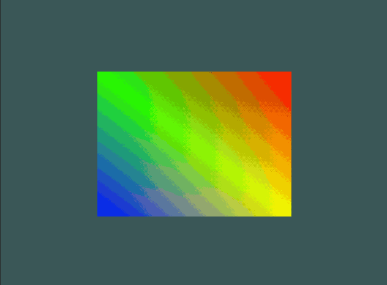

# Lab 3 - Transformation Matrices

*You should work individually on this assignment. To receive credit,
demonstrate your
completed program during lab or create a tag called `lab03` push your
code (and tag) up to Bitbucket and submit the hash to D2L prior to class on
the due date.*

**NOTE: I will post code to get you stared after class on Tue.  You may (but do
not need to) use my code as a starting point.**

In this lab, you’ll learn how to combine transformation matrices to move objects
around in 2D space. A unit square, centered at the origin, is provided with its
vertices set to red, green, blue, and yellow.  You’ll transform the square using
translation, rotation and scaling matrices.  All three matrices will be combined
in your vertex shader to transform the points in your scene.  **You may NOT use a
linear algebra library for this lab.**

## Recommended Reading

Uniform Variables

* GL Chapter 2: Storage qualifiers
* [Uniform variables](https://learnopengl.com/Getting-started/Shaders) (Uniforms section)

Transformations

* FoCG Section 6.1,.3
* [Wikipdeia: Translation Matrix](https://en.wikipedia.org/wiki/Translation_%28geometry%29)
* [Wikipedia: Scale Matrix](http://en.wikipedia.org/wiki/Scaling_%28geometry%29)
* [Wikipedia: Rotation Matrix](https://en.wikipedia.org/wiki/Rotation_matrix)

## Part 1 - Transformation matrices

Use the translation, rotation and scale values to construct a transformation
matrix that will be passed to your vertex shader to adjust the square’s
transform. You must implement the matrices and their operations.  Update your
vertex shader to accept a uniform variable for the transformation and use it
correctly to transform your vertex data.

## Part 2 - Modes

Show off your work!  Use your transformation matrices to implement 4 modes.

- static: image is non-changing
- rotate center: rotate the square around the center of the window
- rotate off center: rotate the square around a point that is not at the center
  of the window.
- scale: scale the square
- impress me: combine multiple matrix transformations to move your square
  however you like.

The user should change modes on spacebar release.

Some helpful tricks for simple periodic animation is to use `sin` and `cos` of
the time.  You can control speed by scaling the time.  Get the time with
`glfwGetTime()`.

Here is an example in a (very low quality) animated gif.

## Things to notice

Now that you have your transformations implemented make sure to spend some time
understanding how the order of the matrix multiplications effects the resulting
transformation.  Also pay attention to how the range of the values effect the
result.  For example, what is the result of a negative scaling?

