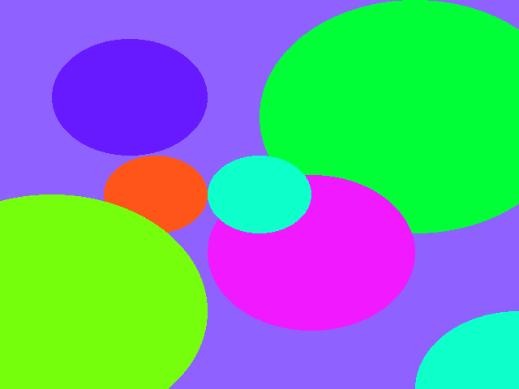

# Lab 8 - Ray Tracing

*You may work individually on this assignment.
To receive credit, demonstrate your
completed program during lab or create a tag called `lab08` push your
code (and tag) up to Bitbucket and submit the hash and images to D2L prior
to class on the due date.*

In this lab, you’ll be exploring the basics of ray tracing. Ray tracing is an
alternative rendering algorithm that lends itself more naturally to effects such
as shadow, reflections, refractions, and is also helpful for identifying
selected objects in 3D.  In this lab we will build a simple ray tracer.  Our ray
tracer will not have any fancy effects (that comes later), but we will produce
am image that looks like

## Recommended Reading

* Foundations of Computer Graphics, Chapter 4.1-.4
* [Wikipedia: Cramers Rule](https://en.wikipedia.org/wiki/Cramer%27s_rule)
* [Paul Rademacher's notes on Ray Tracing](https://www.cs.unc.edu/~rademach/xroads-RT/RTarticle.html)

## Note

In this lab, if you like, you may use matrices and vectors from GLM in addition
to matrix and vector operations.  If you have other methods that you would like
to use please ask on the discussion board.  You CANNOT use GLM's methods for
performing intersections (for example, the methods in <glm/gtx/intersect.hpp>).

Personally, I would suggest switching to GLM.  Now that we have implemented the
basics of a linear algebra library and understand how they work, changing to GLM
will give you an opportunity to start exploring an industry standard library and
compare different design decisions.

## Part 1 - Writing a blank image

For our ray tracer, we will not use any GPU acceleration.  (While you can
perform GPU accelerated ray tracing, it is much harder to do well.)  As we did
in our first lab, we will create a 2D bitmap image for each pixel of the image
we will computer a color.  (You may want to look back at lab 1 for a little more
on creating bitmap images.)

So, lets start off by creating an image.  Select a background color (I picked
the color `(75, 156, 211)`) and iterate over each pixel of the image and set the
background color.

Your image should be a solid color, for example:

## Part 2 - Create some primitives

Our final result will render a collection of sphere.  I created a simple sphere
(with an id) and a viewport, but you may want to create additional classes as
you go.  For example in the next part we will generate the collection of rays
that we will trace.  In this section create a struct (or a class) for a ray.  A
useful ray representation for this lab is to store for each ray an origin and a
direction where the direction is normalized.

## Part 3 - Coloring each pixel

Next, for each pixel, we will need to generate a ray, intersect the ray with
each sphere in the world to find the first intersection and then color the pixel
with the color of the sphere with the first intersection.

## Part 3a - Generate orthographic rays

We will assume that the camera at the origin looking towards positive *z* with
up vector (0,1,0).  This assumption allows us to simplify computing the origin
of each ray.

First, for each pixel (i, j), we will generate the ray *rij*.  Recall that for
an nx x ny pixel image and with a viewport defined by a box with a min point of
(l,b) and max point (r, t), if we let

    ui = l + (r-l)*(i+.5) / nx
    vj = b + (t-b)*(j+.5) / ny,

in our simplified camera model since the viewport is on the *xy*-plane, we have
`rij.origin = (ui, vi, 0)`.  And for an orthographic camera with basis (u, v,
w), we have the direction of each ray is *-w*.   In our simplified camera model,
since w = (0,0,1), each ray has direction (0,0,-1).

## Part 3b - Finding the first intersection

Implement a method for finding the intersection of a ray and a sphere and use
this method to find the first sphere intersected by the ray.

## Part 3c - Color the pixel

Color the pixel with the color of the sphere identified in the previous step.

If all goes well, you will see an image similar to

## Part 3d - Generate perspective rays

Next we will generate rays that simulate depth by making objects that are far
away look smaller.  We do this moving the camera a distance *d* away from the
viewport in the camera's *w*-direction. Let *e* be the position of the camera.
For each ray *rij*, we set `rij.origin` to the camera.  In our simplified camera
model, *e = (0,0,-d)*.  We set `rij.direction`  by subtracting *e* from the
point *(ui, vj)* on the viewport (which, in fact, was the origin in the rays for
the orthographic projection).  Be sure to normalize the direction rays.

## Part 3e - Use the perspective

Use the perspective rays to render another image.

## Part 4 - Prepare for submission

Play around with your ray tracer. Add spheres, change colors, and  change the
color of the background.  When you are happy with your creation, render two
images, `orthographic.bmp` and `perspective.bmp` with orthographic and
perspective projection, respectively.

Submit your assignment. In the submission, along with the regular git commit
hash and link, upload your two images, `orthographic.bmp` and `perspective.bmp`.

## Things to notice

Our images are relatively bland because we didn't implement any visual effects
like shading or reflection... Don't worry, you will have the opportunity to do
that in program 4!
