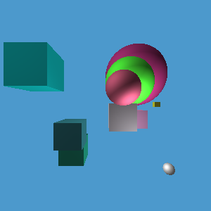

# Lab 9 - Spatial Data Structures

*You may work individually or in teams on this assignment.
To receive credit, create a tag called `lab09` push your
code (and tag) up to Bitbucket and submit the hash and report to D2L prior
to class on the due date.*

In this lab, you’ll be exploring spatial data structures for ray tracing.
We have seen that as we render higher resolution images with ray tracing, the
time to render a frame can explode.
In this lab, we will explore how we can use spatial data structures to help
reduce the rendering time.

Our ray tracer will still not have have any fancy effects (that comes
later), but we will produce am image that looks like the following
(or maybe even more boxes!)

## Recommended Reading

* Foundations of Computer Graphics, Chapter 12.3
* [Spatial Data Structures -- Hanan Samet](http://www.cs.umd.edu/~hjs/pubs/kim.pdf)

## Note

In this lab, you may use any functions that you like from GLM.

## Part 1 - Scaling the number of boxes

On line 70 of the code, we can set the number of boxes that will be rendered.

    // set the number of boxes
    int NUM_BOXES = 1;

Observe that as you increase the number of boxes, the rendering time increases.
For example on my machine, I get:

num boxes   | time (ms)
-----------------------
1           | 3524.07
2           | 6832.43
4           | 13316.6

If we are going to try to speed up our rendering times, we need a base line.

Get some baseline timing data on your own system.  I would suggest trying to get
samples until it takes about 60 seconds to render the image.

Plot your timings using your favorite plotting package. (Mine is
[matplotlib](https://matplotlib.org/) , but I have started to come around to
[seaborn](https://seaborn.pydata.org/).)

## Part 2 - Ray/box predicate

Most good spatial data structures rely on computing ray and box intersections.
Let's get started by implementing a *predicate* that takes a axis-aligned box
and a ray and returns true if the box intersects the ray, and false otherwise.

## Part 3 - Build some boxes

Next, we will implement a new `Intersector` that will use the predicate from the
previous section to speed up rendering.

Update your code so that whenever you call the `random_box()` function, instead
of simply putting the triangles into the world, you first use the triangles to
create a box for a spatial data structure (and then put the triangles into the
world.  Now, we will need a place to store all these bounding boxes!

## Part 4 - Use your predicate

Now we get to have some fun!  Implement a class (for example,
`MySlickIntersector`) that extends `Intersector`. Implement the
`find_first_intersection` function to take advantage of the boxes computed in
Part 3.  Start simple, perhaps don't use any hierarchical structures.  Record
the timings in the same way that you did in part 1.

Did it improve?  If so, great!  Create another plot that demonstrates the
improvement.  If it did not, great!  We know what didn't work.  Create another
plot that demonstrates the regression.

Iterate on a few ideas each time getting timings as you vary `NUM_BOXES`.
Try at least two ideas for building spatial data structures.
Each time, record the timings and the plot the results.

## Part 5 - Writeup your results

Crate a brief writeup of your findings.  For each of your data structures,
provide a description of the data structure and a discussion of how the timings
improved or regressed.  Pictures can be very helpful in your descriptions.
Don't worry if some ideas do not work, that is part of the fun!

## Things to notice

Not all ideas work out well, but if you keep trying out different techniques and
recording your experimental results, you will be able to continuously improve
your code.  Note, that local improvements will only get you so far though.
While you can sometimes see big improvements with minor changes, often, you will
need a "paradigm shift" to see major improvements!
