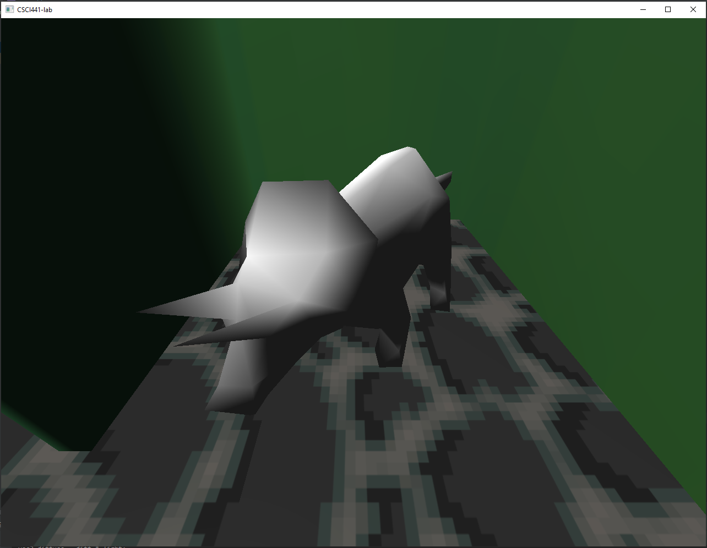
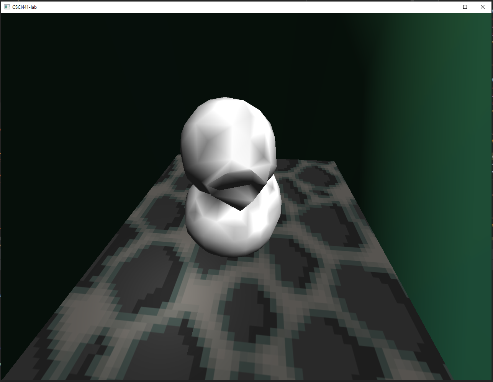
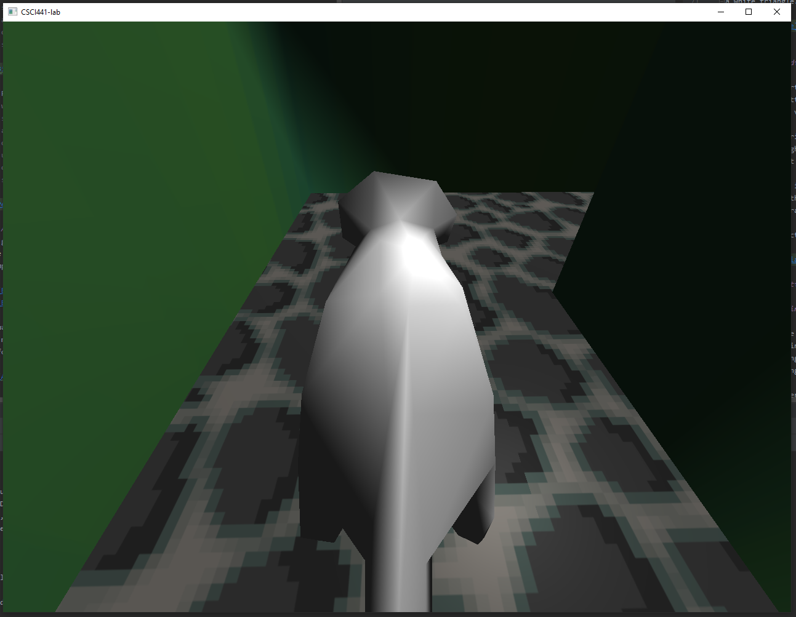
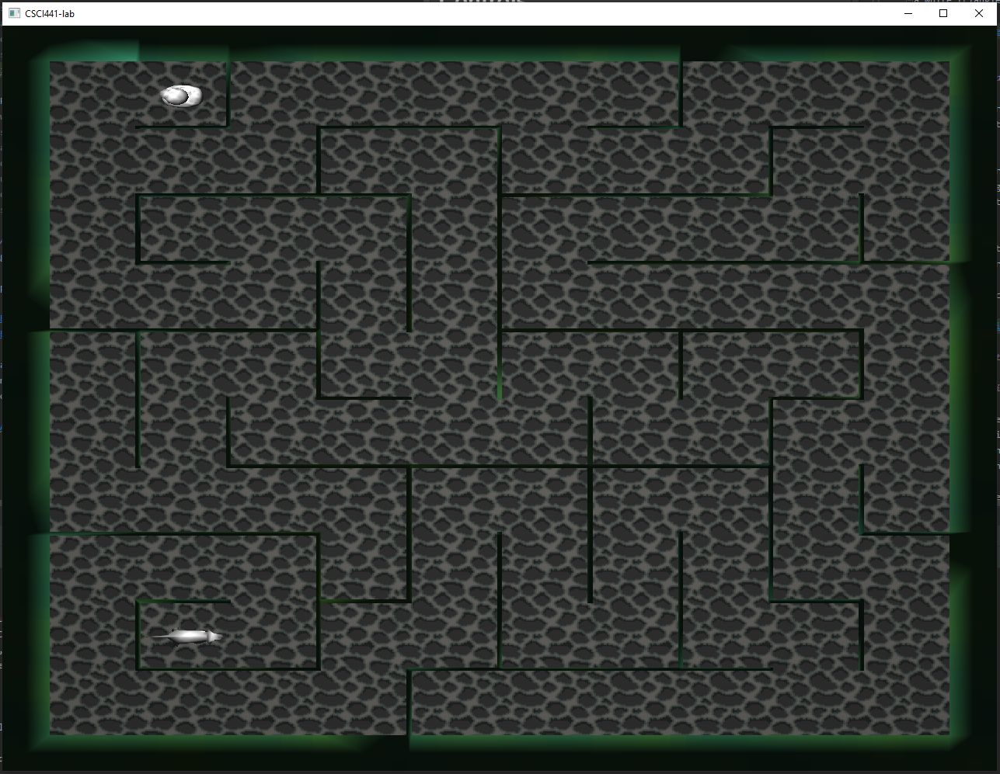

# Project 1: 
This program loads in models from obj files then places them into the 
world. I created the models for the maze and ground using Blender. 
The models for the characters were provided for us. I used a pixel art program
called Aseprite to make the texture for the ground and maze walls. All of the controls 
are keyboard based. I used the shader files from Lab 7 as a starting point and added
the needed components to them.

## Plot:

Ben is the ghost of a triceratops and his favorite ghost duck, Ducky, has gotten lost in the hedge 
maze. Your goal is to guide the Ben to Ducky. 

Ben:

Ducky:

## Controls:
The controls to navigate the maze are as follows:

In Perspective View:

* `w`: moves in the direction the character is facing

* `s`: move in the opposite direction the character is facing

* `a`: rotates the character counter clockwise

* `d`: rotates the character clockwise

* `up arrow`: pans the camera up

* `down arrow`: pans the camera down

* `spacebar`: switches to birds eye view

In Birds Eye View:

* `w`: moves in the direction the character is facing

* `s`: move in the opposite direction the character is facing 

* `a`: rotates the character counter clockwise

* `d`: rotates the character clockwise

* `spacebar`: switches to perspective view

## Acknowledgements:
To generate a random maze, I followed the maze tutorial below. 
The tutorial used an add-on that made generating the maze within a few
simple steps. 

* [Blender Maze Tutorial](https://www.youtube.com/watch?v=QzTISx91HOI)
* [MeshMaze Blender Add-on](https://github.com/elfnor/mesh_maze)

I wanted to make the maze look like it was from a video game from ages ago. 
To make the textures for the maze walls and the path, I followed 
the tutorial below to make a texture that looks good when tiled.
Unfortunately, the UVs of the maze cause the texture for the hedge 
to be a bit stretched. 

* [Aseprite Texture Tutorial](https://www.youtube.com/watch?v=6U1WAHwmlc0)

## Final Notes:
Overall, I'm happy with the current results. I feel like I learned a lot with this
project. There were some ideas that I do want to implement at a later date like:

* Collision detection

* Simulated day/night cycle

* Flashlight like light source

* Maze difficulty selection

* Mouse camera controls